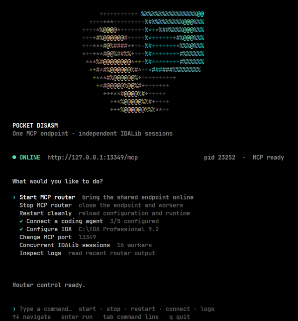
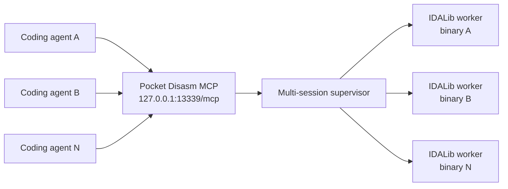

<div align="center">


# Pocket Disasm

**One MCP endpoint. Many isolated IDALib sessions.**

A lightweight, agent-first control layer for headless binary analysis with the
IDA Pro MCP toolset.

[](#requirements)
[](#requirements)
[](LICENSE)

</div>

> [!IMPORTANT]
> Pocket Disasm is an independent open-source project. It is not affiliated
> with, endorsed by, sponsored by, or an official product of Hex-Rays.
> IDA Pro and IDALib are products of Hex-Rays and require a separate valid
> installation and license. Pocket Disasm does not distribute IDA, IDALib, or
> any Hex-Rays software.

Pocket Disasm runs one public MCP router and gives every binary its own IDALib
worker. Coding agents can create, select, inspect, save, and close analysis
sessions without launching a separate interactive IDA window for every file.

The project uses a pinned revision of
[mrexodia/ida-pro-mcp](https://github.com/mrexodia/ida-pro-mcp) as its core MCP
analysis implementation and tool catalog. Pocket Disasm builds its unified
multi-session router, process isolation, agent integrations, diagnostics, and
terminal control center around that upstream project.

<div align="center">
  
</div>

## Install

Run one command in PowerShell:

```powershell
irm https://raw.githubusercontent.com/whoisqwerz/pocket_disasm/main/install.ps1 | iex
```

Then open a new terminal and run:

```powershell
pocket
```

The installer creates an isolated Python environment under
`%LOCALAPPDATA%\PocketDisasm`, installs pinned dependencies, adds the `pocket`
command to the user `PATH`, and opens the terminal control center.

## Why Pocket Disasm

- **One endpoint** — agents connect to a single streamable HTTP MCP endpoint.
- **True multi-session analysis** — each binary runs in an independent IDALib process.
- **Parallel agent workflows** — several agents can analyze different binaries simultaneously.
- **IDA Pro MCP compatibility** — analysis calls are routed to the pinned `ida-pro-mcp` tool catalog.
- **Agent-managed sessions** — the LLM can open and switch binaries through MCP tools.
- **Built-in integrations** — configure Codex, Claude Code, Cursor, VS Code, and Windsurf from the TUI.
- **No IDA GUI automation** — workers use IDALib directly and do not need interactive IDA windows.
- **Persistent diagnostics** — router, worker, installer, update, and lifecycle events are recorded.
- **Self-update support** — the TUI checks GitHub on launch and offers in-place updates.

## Quick start

1. Run `pocket`.
2. Choose **Configure IDA** and select the directory containing `idalib.dll`.
3. Choose **Connect a coding agent** and select global or project scope.
4. Adjust **Concurrent IDALib sessions** if necessary.
5. Choose **Start MCP router**.
6. Restart or reload the configured coding agent.

The default endpoint is:

```text
http://127.0.0.1:13339/mcp
```

The port can be changed from the TUI. Pocket Disasm updates every MCP
configuration file it previously registered and restarts the router when
needed.

## Agent workflow

Agents do not need a dedicated MCP server for every binary. They create and
route sessions through the shared endpoint:

```text
idb_open(input_path="C:\\samples\\first.exe", session_id="first", wait=true)
idb_open(input_path="C:\\samples\\second.dll", session_id="second", wait=true)

decompile(addr="main", database="first")
survey_binary(database="second")
```

Selection can also be scoped to the current MCP client:

```text
idb_select(database="first")
decompile(addr="main")
```

This lets one model manage several binaries or several agents work through the
same router without sharing a selected database.

## Architecture



Every active session has its own process, internal port, isolated analysis
workspace, IDA database, and worker log. The configurable worker limit prevents
unbounded process creation; the default is 8 and the TUI accepts values from 1
to 128.

## Session management tools

Pocket Disasm adds the following tools to the regular IDA MCP catalog:

| Tool | Purpose |
| --- | --- |
| `idb_open` | Create an isolated session for a local binary |
| `idb_list` | List sessions, states, processes, and current selection |
| `idb_select` | Select a default session for the current MCP client |
| `idb_health` | Read worker startup and process health |
| `idb_wait` | Wait for IDA auto-analysis and MCP startup |
| `idb_save` | Save the current IDA database |
| `idb_logs` | Read recent output from one worker |
| `idb_close` | Stop a worker and release its resources |

Regular analysis tools such as `survey_binary`, `lookup_funcs`, `func_query`,
`find_bytes`, and `decompile` accept an optional `database` argument. If it is
omitted, Pocket Disasm uses the session selected by that MCP client.

## Coding agent integrations

The TUI merges only the `pocket-disasm` MCP entry into existing configuration
files; it does not replace the entire file.

| Agent | Global configuration | Project configuration |
| --- | --- | --- |
| Codex | `~/.codex/config.toml` | Global endpoint is used |
| Claude Code | `~/.claude.json` | `.mcp.json` |
| Cursor | `~/.cursor/mcp.json` | `.cursor/mcp.json` |
| VS Code | User profile `mcp.json` | `.vscode/mcp.json` |
| Windsurf | `~/.codeium/windsurf/mcp_config.json` | Global endpoint is used |

The same operation is available from the CLI:

```powershell
pocket integrate codex claude cursor --scope global
pocket integrate claude cursor vscode --scope project --project-dir .
```

## CLI

The TUI covers normal installation and control. The CLI remains available for
automation and diagnostics:

| Command | Description |
| --- | --- |
| `pocket` | Open the terminal control center |
| `pocket doctor` | Validate Python, IDA, IDALib, and MCP dependencies |
| `pocket start` | Start the unified router in the background |
| `pocket stop` | Stop the router and its workers |
| `pocket restart` | Restart the router |
| `pocket status` | Show endpoint and daemon state |
| `pocket logs` | Print recent diagnostic output |
| `pocket port <port>` | Change the endpoint in registered agent configs |
| `pocket config --max-workers <n>` | Set the concurrent worker limit |
| `pocket integrate <agents>` | Configure one or more coding agents |

Run `pocket <command> --help` for all options.

## Configuration and logs

Pocket Disasm stores its user state under:

```text
%LOCALAPPDATA%\PocketDisasm
```

Important files include:

| File | Contents |
| --- | --- |
| `config.json` | IDA path, endpoint ports, and worker limit |
| `integrations.json` | MCP configuration files managed by Pocket Disasm |
| `events.log` | Structured lifecycle events and exception tracebacks |
| `pocket-disasm.out.log` | Router standard output |
| `pocket-disasm.err.log` | Router error output |
| `sessions/<session>/worker.log` | Persistent output for an IDALib worker |
| `installer.log` | Installation and upgrade transcript |
| `update.log` | In-TUI updater output |

Use **Inspect logs** in the TUI or run:

```powershell
pocket logs
```

## Updates

The TUI checks for a newer version once when it starts. When an update is
available, **Update Pocket Disasm** appears in the action list. The updater
preserves configuration, updates the isolated environment, restarts the TUI,
and brings the router back online if it was previously running.

## Requirements

- Windows 10 or Windows 11.
- Python 3.11 or newer. The installer can install Python 3.12 through `winget`.
- A separately installed and licensed IDA version that provides IDALib.
- Network access during installation, agent dependency setup, and update checks.

Pocket Disasm does **not** include IDA, IDALib, or an IDA license. It is an
independent project and is not affiliated with or endorsed by Hex-Rays.

## Uninstall

```powershell
$script = irm https://raw.githubusercontent.com/whoisqwerz/pocket_disasm/main/install.ps1
& ([scriptblock]::Create($script)) -Uninstall
```

Agent MCP entries are deliberately not removed automatically, so unrelated
configuration is never rewritten during uninstall. They can be removed from
the corresponding agent configuration files if no longer needed.

## Acknowledgements

- [mrexodia/ida-pro-mcp](https://github.com/mrexodia/ida-pro-mcp), created and
  maintained by mrexodia, provides the core IDA MCP server and analysis tools
  used by Pocket Disasm. The upstream project is distributed under the MIT
  License.
- Hex-Rays provides IDA and IDALib, which must be installed and licensed
  separately by the user.

## License

Pocket Disasm is released under the [MIT License](LICENSE).
